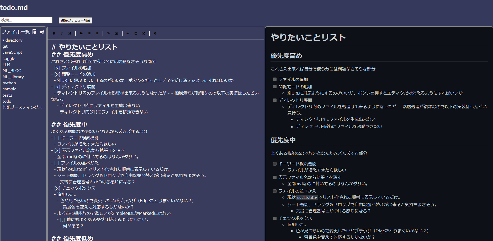

# 概要
ブラウザからMarkdownで作業記録を作るためのwebシステムです。  
ファイルはローカルに保存して使うことを想定しています。  


# 注意
ローカルで動かす前提、素人が個人開発で動かしてみることを目的にしているためセキュリティ周りは何も考慮されていません。  
バグによるデータ消失には細心の注意を払っていますが責任は持てません。
初心者がJavaScriptやHTMLの勉強に使っているリポジトリのためどんどんプルリクエストを送っていただければと思いますが、不慣れなため反応は遅くなると思います。  
`app.py`内での`Flask`実行が`run(debug=True)`のままになっています。特に追加で変更しない場合は`False`にしてください。  

# 開発環境
Microsoft Edgeで動作を確認しています。  
今後他のブラウザでも動くか試す予定は特にありません。  

# クローンとパッケージインストール
```
git clone https://github.com/O-taxi/MDWorkspace.git
cd MDworkspace
mkdir works
pip install -r requirement.txt
```

# 実行
```
python app.py
```
実行すると
```
 * Running on http://127.0.0.1:8000
 * Running on http://<ip adress>:8000
```
等と表示されます。  
このアドレスをブラウザに入れることで閲覧できます。  
VSCodeのターミナルで実行するとポップアップでブラウザから開くか聞いてくれてびっくりします。どの拡張機能のおかげかわかってない……。  
編集したファイルは`works`ディレクトリ内に保存されます。