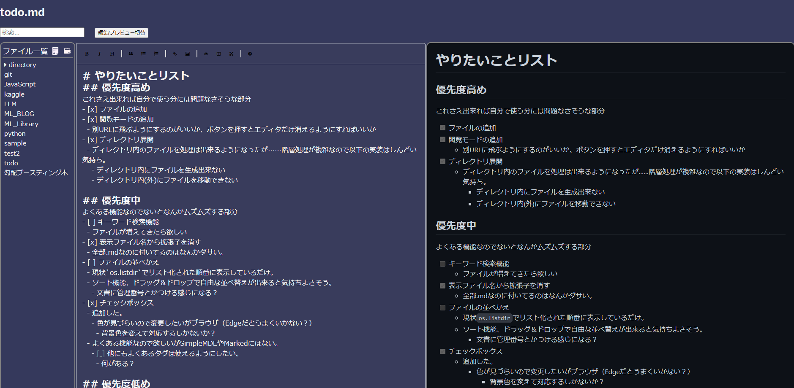

# テスト
## ブロック作成の例
- インラインコード  
 `pip install -U pip`
- コードブロック
```python
print("Hello World!")
```
- URL  
[github markdown css](https://github.com/sindresorhus/github-markdown-css/tree/main)
- 画像

